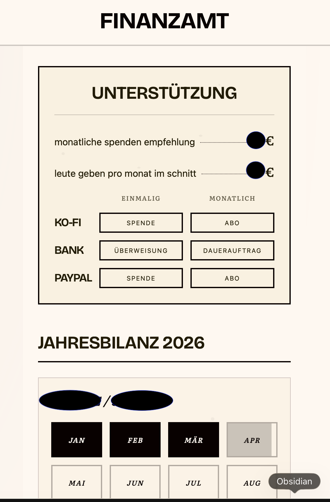
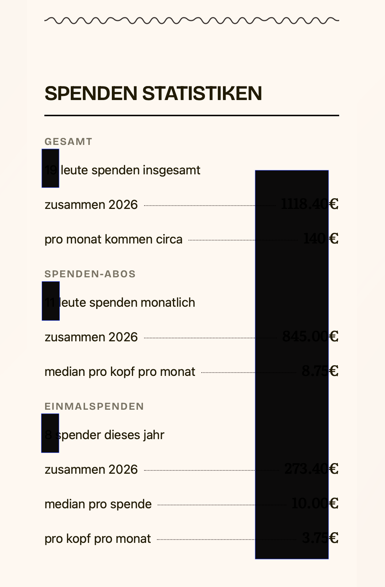

# finanzamt

Transparent donation tracking for projectmellon.de infrastructure.  
Shows monthly costs, tracks donations, displays progress towards funding goal.

**[finanzamt.projectmellon.de](https://finanzamt.projectmellon.de)**





## Stack

Python Flask • single JSON file • Tailwind CSS (CDN) • Docker

## Run locally

```bash
cp data.json.example data.json
pip install -r requirements.txt
python app.py
```

## Deploy

```bash
ansible-playbook -i ansible/inventory/hosts.yml ansible/playbooks/deploy.yml
```

## Admin

`/admin` — basic auth, CSV import for bank/PayPal donations, subscriber management

## License

MIT
